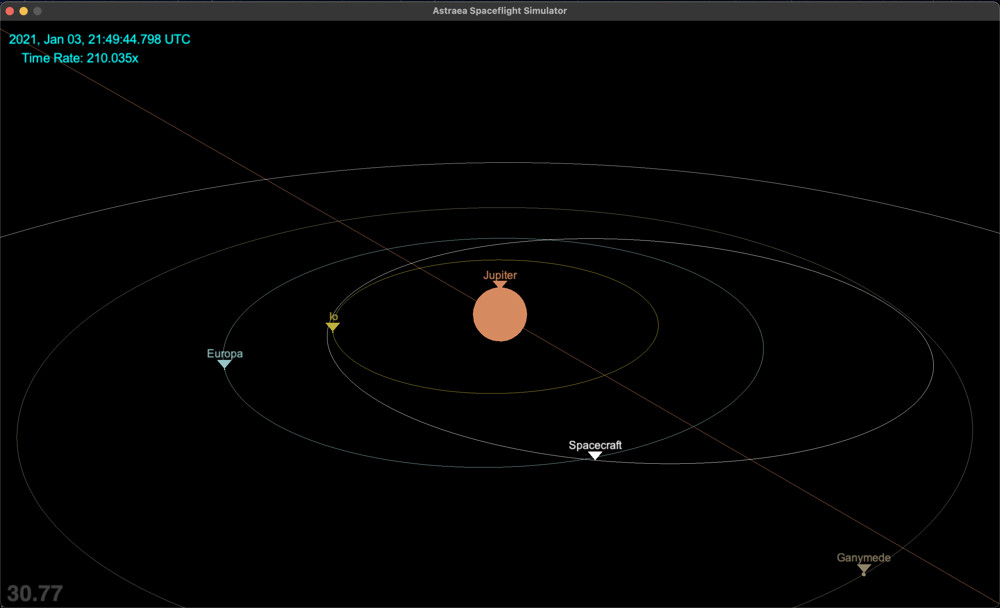
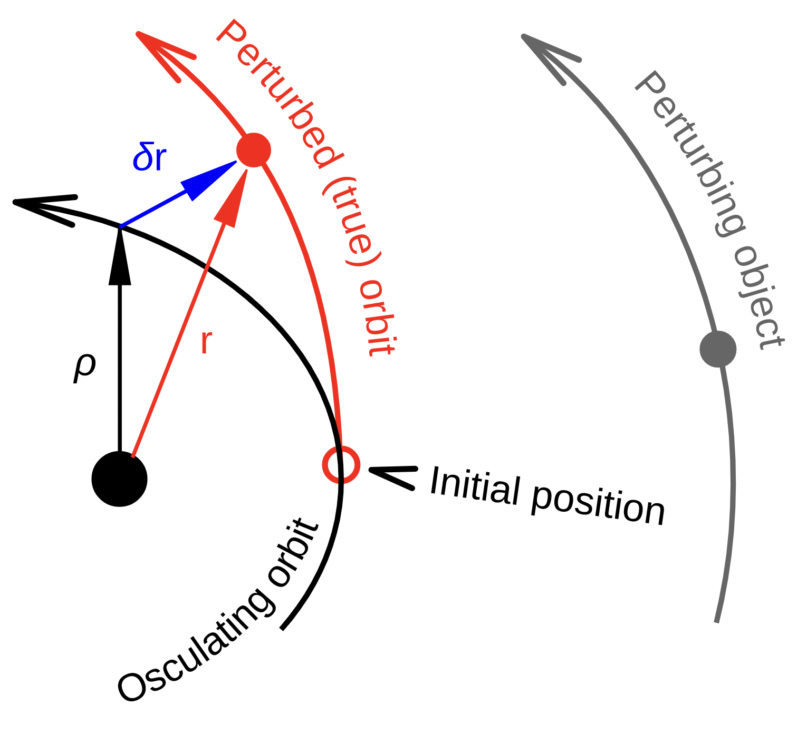
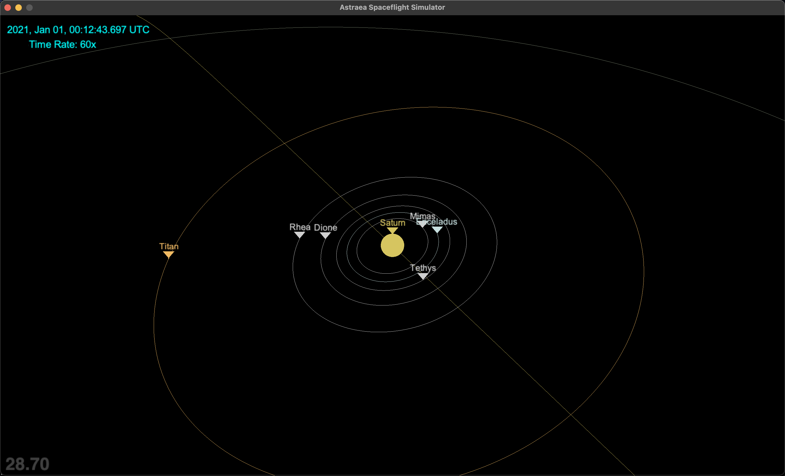

# Astraea Spaceflight Simulator
Flynn Bryant
flynn.bryant2001@gmail.com | fbry0688@uni.sydney.edu.au
## Overview

Astraea Spaceflight Simulator is an orbital mechanics simulation written in Python and OpenGL, updating the positions of 38 notable celestial bodies in the solar system. The objects and their current orbital path are displayed to the screen as the simulation progresses. A series of controls (outlined below) can be used to change the rate of simulation time, camera position, and to manoeuvre a spacecraft between orbits and bodies.

The simulation can be started by running astraea.py

## Orbital Prediction
Currently, Cowell's method of orbital modelling has been chosen for this project, however to achieve my accuracy goals as outlined below, I am working on implementing Encke's method as an excellent balance between accuracy and performance. In Encke's method, each object is first assumed to only be affected by a single dominant object (like the Sun for the Earth) and an analytical orbital solution is calculated from this assumption. From that, the numerically integrated perturbations from other objects are applied to get the true position.

## Dependencies
The following libraries are required for the program to run:
- pyglet
- OpenGL
- PyOpenGL
- numpy

## Controls
- WASD or the arrow keys are used to rotate the camera.
- The + and - keys are used for zoom
- F and G are used to switch focus between celestial bodies
- O and P adjust the rate of simulation time.

Spacecraft Manoeuvers (using the same controls as Kerbal Space Program's translation thrusters):
- H and N for prograde and retrograde acceleration
- I and K for plane change normal and antinormal acceleration
- J and L for radial acceleration

## Improvements
I am constantly striving to improve the simulation speed and accuracy, allowing for more celestial bodies to be added with the same performance and with the goal of simulating solar eclipse shadows to within 1km. This can be achieved through the more accurate calculation of motion around planetary barycentres (in this case the Earth-Moon barycentre) and the use of varying timesteps to focus more computational resources on the objects that are more sensitive to pertubations (such as the Moon instead of gas giants.)
I also plan to add more advanced spacecraft ‘autopilot’ options which involve the computation of efficient trajectories to Lagrange points, gravitational slingshots, and rendezvous with other spacecraft.

